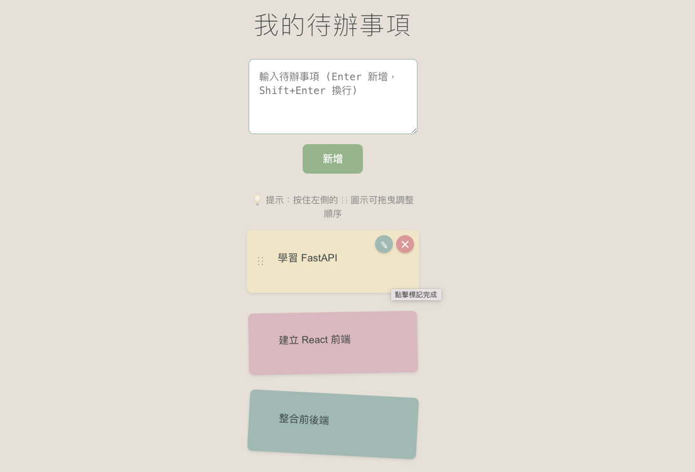

# PostItTodo - 便利待辦貼

現代化的全端待辦事項應用，具備拖曳排序、即時同步等功能。

## 🌐 線上 Demo

(無需安裝任何東西)

## ✨ 專案特色

- **拖曳排序**: 使用 @dnd-kit 實現流暢的拖曳體驗
- **即時更新**: 樂觀更新策略，操作回饋快速
- **響應式設計**: 支援桌面、平板、手機
- **Docker 部署**: 一鍵部署，環境一致
- **資料持久化**: SQLite 資料庫，支援 Volume 掛載

## 🛠️ 技術棧

### 前端
- React 18 + TypeScript
- Vite (建置工具)
- @dnd-kit (拖曳功能)
- CSS3 (經典色系設計)

### 後端
- FastAPI (Python 3.12)
- SQLAlchemy (ORM)
- SQLite (資料庫)
- Uvicorn (ASGI 伺服器)

### DevOps
- Docker + Docker Compose
- Multi-stage Build
- Volume 資料持久化

## 🚀 快速開始

## 方式 1: 使用 Docker (推薦)
### 1. Clone 專案
git clone https://github.com/你的帳號/todo-app.git
cd todo-app

### 2. 啟動服務
docker-compose up -d

### 3. 訪問應用
open http://localhost:8000

## 方式 2: 線上 Demo (最佳體驗)

部署到免費平台:

**Render.com** (推薦):
1. 連接 GitHub repo
2. 自動偵測 Dockerfile
3. 免費部署
